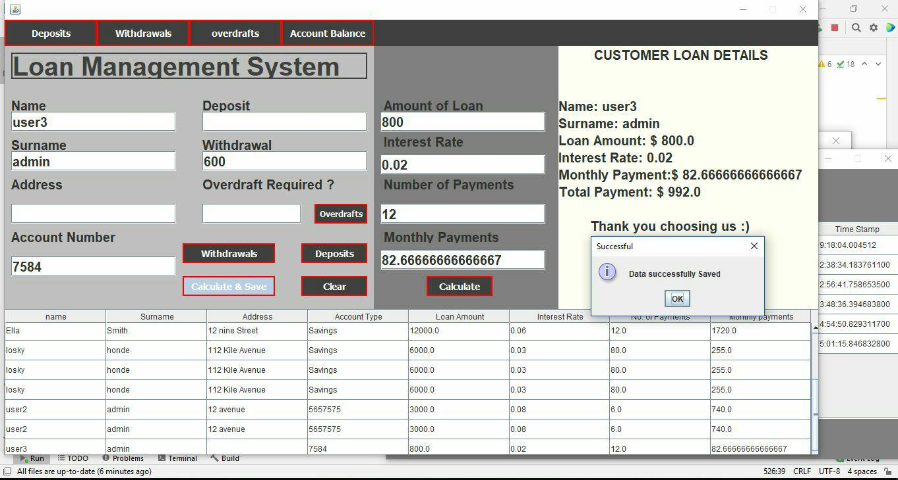

# Loan-management-System-Begginers-

*This project was developed using java programming lunguage and however most of the code was written using imperative programming.

**Imperative programming** is a software development paradigm where functions are implicitly coded in every step required to solve a problem. In imperative programming, every operation is coded and the code itself specifies how the problem is to be solved, which means that pre-coded models are not called on 
[www.techtarget.com](https://www.techtarget.com/whatis/definition/imperative-programming#:~:text=Imperative%20programming%20is%20a%20software,models%20are%20not%20called%20on.).

## Piece of Code
### private void CalculateLoan() {
        if (this.loan_amount_field.getText().equals("")) {
            JOptionPane.showMessageDialog((Component)null, "Please Enter: Loan Amount", "AmountError", 0);
        } else if (this.interest_field.getText().equals("")) {
            JOptionPane.showMessageDialog((Component)null, "Please Enter Interest Rate ", "InterestError", 0);
        } else if (this.total_payments_field.getText().equals("")) {
            JOptionPane.showMessageDialog((Component)null, "Please Enter No of Payments ", "PaymentsError", 0);
        } else {
            Double Loan_amount = Double.parseDouble(this.loan_amount_field.getText());
            Double interest = Double.parseDouble(this.interest_field.getText());
            Double numberOfPayments = Double.parseDouble(this.total_payments_field.getText());
            Double totalinterest = Loan_amount * interest;
            Double totalAmountPlusInterest = totalinterest * numberOfPayments + Loan_amount;
            Double monthlypayments = totalAmountPlusInterest / numberOfPayments;
            this.monthly_payments_field.setText(monthlypayments.toString());
            
            System.out.println("number of payments" + numberOfPayments);
            System.out.println("amount of interest" + totalinterest * numberOfPayments);
            System.out.println("total payments" + totalAmountPlusInterest);
            System.out.println("monthly payments" + monthlypayments);
           
  ###      }
  
   ## Database Details 
   
   **The database used in this project is Maria Db  through [Xampp](https://www.apachefriends.org/)**
   - String username = "root";
   - String password = "";
   -  String databaseUrl = "jdbc:mysql://localhost:3306/loan_info";

